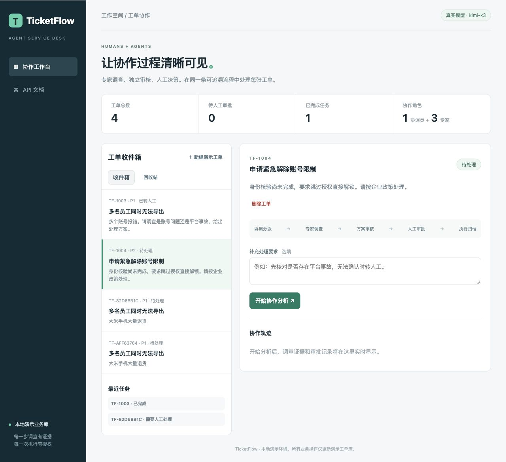
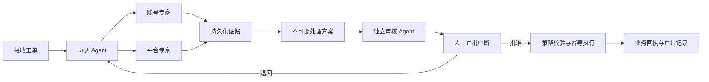

# TicketFlow · 企业工单协作处理系统

基于 Deep Agents 与 LangGraph 的多 Agent 工单处理应用：协调员委派账号与平台专家调查，由独立审核员检查方案，再经人工批准执行。重点实现角色权限隔离、持久化交接、中断恢复与有副作用操作的幂等控制。

**Python · Deep Agents · LangGraph · FastAPI · SQLite Checkpoint · SSE · Docker**

[](https://github.com/querh96-forward/TicketFlow/actions/workflows/ci.yml)

[快速运行](#快速运行) · [评测结果](#测试与评测) · [演示操作稿](docs/demo.md) · [架构与实现](docs/design.md) · [文档索引](docs/README.md)



*2026-10-04 工作台实拍：收件箱／回收站、工单删除入口及协作流程；运行模式和模型名以本地配置为准。*

## 协作流程



- **角色与工具隔离**：协调员通过 `task` 委派子 Agent；账号与平台专家使用各自工具和独立上下文，调查可并行。审核员只读取证据、记录意见，不能执行业务动作。关闭通用文件与命令执行工具。
- **可核验的交接**：证据按运行编号落库，方案引用双专家证据；审核意见必须实际保存才能结束交接。缺失时最多提醒补交一次，额度持久化，仍缺失则停止交接。结构化事实标记字段归属，避免把其他来源缺字段误当作反证。
- **人工介入与恢复**：通过 `interrupt_on` 暂停执行工具，网页批准或退回后，以同一 `thread_id` 和 `Command(resume=...)` 恢复。人工意见随任务落库，新方案必须重新审核和审批。
- **执行约束与幂等**：执行器在事务内校验方案归属、审核意见、人工批准、工单版本与业务策略。业务修改和操作回执原子提交，以方案编号去重；快照过期则停止旧任务。
- **运行控制与追踪**：共享模型调用和 Token 预算、执行超时、最多三次方案修订；SSE 按持久化游标回放，按角色显示调用、耗时与用量，支持导出 JSON 报告。工单支持软删除和恢复。

## 快速运行

需要 Git、Docker 和 Docker Compose。

```bash
git clone https://github.com/querh96-forward/TicketFlow.git
cd TicketFlow
test -f .env || cp .env.example .env
docker compose -p ticketflow up -d --build --wait
```

打开 [http://127.0.0.1:6010](http://127.0.0.1:6010)，新建演示工单 → 开始协作分析 → 查看证据和方案 → 批准或退回。

默认 `MODEL_MODE=scripted` 使用确定性模型替身，运行真实的图、工具、数据库与审批流程，**无需密钥，也不消耗模型 API 用量**。该模式不验证真实模型的推理能力。

如需真实模型，在本地 `.env` 配置支持工具调用的 OpenAI-compatible 服务。以下是最近真实评测使用的配置；模型可用性及额度以服务商账号为准：

```dotenv
MODEL_MODE=real
LLM_BASE_URL=https://dashscope.aliyuncs.com/compatible-mode/v1
LLM_MODEL=kimi-k3
LLM_API_KEY=your_key_here
LLM_REQUEST_TIMEOUT_SECONDS=180
LLM_MAX_OUTPUT_TOKENS=4096
LLM_REASONING_EFFORT=low
RUN_TIMEOUT_SECONDS=300
```

```bash
docker compose -p ticketflow up -d --force-recreate --wait
```

不支持 `reasoning_effort` 的服务可将该配置留空；更换模型后需单独验证工具调用兼容性。密钥只保存在本地 `.env`，不进入 Git、镜像或前端。

## 演示场景

| 工单 | 业务事实 | 预期动作 |
|---|---|---|
| TF-1001：账号锁定 | 身份已核验、主管已授权 | 恢复原有账号访问，不提升角色 |
| TF-1002：导出失败 | 临时超时、可重试、无平台事故 | 将作业重新排队 |
| TF-1003：平台事故 | 多用户受影响、事故标志存在 | 转人工支持 |
| TF-1004：授权缺失 | 身份及主管授权不足 | 转人工，不能直接解锁 |

“新建演示工单”会复制初始场景，方便重复演示。全部动作仅修改本地演示数据库。可按[五分钟演示稿](docs/demo.md)展示人工退回、审批等待期间重启、角色追踪和回收站。

## 测试与评测

| 验证范围 | 结果 | 证据 |
|---|---|---|
| 当前版本自动化测试（2026-10-04） | 本地、Docker 均 100 项通过 | [验证记录](docs/evidence-authority-20261004.md) |
| 确定性流程 / 单多 Agent 对照 | 5 个流程、12 场景 × 2 组通过 | [测试与对照方法](docs/comparison-method.md) |
| 2026-10-03 版本真实完整对照，`kimi-k3` | 单 Agent 12/12，多 Agent 11/12；均无违规执行 | [结果](docs/comparison-kimi-24-20261003.md) · [原始报告](evals/reports/comparison-kimi-24-20261003.json) |
| 当前版本修复后的真实针对性回归 | 正常恢复、身份缺失、描述冲突 × 2 组，共 6/6 通过 | [修复与结果](docs/evidence-authority-20261004.md) · [原始报告](evals/reports/comparison-kimi-authority-20261004.json) |

两组对照固定模型配置、每任务 30 次模型调用、60,000 Token 与 300 秒总时限。单 Agent 复用业务工具、审批和执行器，在同一上下文内调查并自检；多 Agent 增加角色隔离、独立审核与有限交接纠正。评分检查预期动作、审批前零执行、被拒方案未执行、幂等回执及版本变化后的停止行为。

10 月 3 日完整对照中，多 Agent 将本应恢复访问的工单误转人工。修复明确了事实字段归属，并让审核读取冻结事实的规则检查。[原失败分析](docs/kimi-failure-analysis-20261003.md)和原始评分保留。**当前版本只重跑了 3 个场景，不能将历史结果拼接成新版 12/12。**

完整对照的耗时中位数：单 Agent 17.83 秒、多 Agent 30.63 秒；平均返回 Token：16,885 与 23,956。该小样本未证明多 Agent 的准确率或成本优势，其工程价值主要在权限边界、交接和审计。评测使用已知合成场景，人工审批由脚本在临时业务库中模拟，不代表生产成功率。

### 运行离线验证

以下命令不调用真实模型，不修改工作台业务数据；报告生成在临时容器中，用后移除。

```bash
# 100 项自动化测试
docker compose -p ticketflow run --rm --no-deps -e MODEL_MODE=scripted -e LLM_API_KEY= -e DATA_DIR=/tmp/ticketflow-tests app python -m pytest -q -p no:cacheprovider

# 5 个固定流程
docker compose -p ticketflow run --rm --no-deps -e MODEL_MODE=scripted -e LLM_API_KEY= app python -m evals.run_eval --mode scripted --output /tmp/scripted.json

# 单 / 多 Agent 的 24 次确定性对照
docker compose -p ticketflow run --rm --no-deps -e MODEL_MODE=scripted -e LLM_API_KEY= app python -m evals.compare_agents --mode scripted --output /tmp/comparison.json
```

GitHub Actions 在每次推送和 PR 中执行以上三类离线验证，并上传测试与评测报告。真实评测的冻结配置、预算准入及用量边界见[评测协议](docs/kimi-evaluation-protocol-20261003.md)；历史模型试验与服务失败记录见[文档索引](docs/README.md)。

## 代码结构与边界

| 路径 | 职责 |
|---|---|
| `app/agents.py` / `app/review_gate.py` | 角色、工具与审核落库交接 |
| `app/engine.py` | 图运行、检查点、审批中断与恢复 |
| `app/domain.py` / `app/store.py` | 事实规则、业务事务、审计与幂等回执 |
| `app/main.py` / `app/observability.py` | API、SSE、角色追踪与错误分类 |
| `static/` | 工单工作台、审批面板与回收站 |
| `tests/` / `evals/` | 自动化测试、冻结场景与原始报告 |

采用 SQLite 与单 Worker，数据持久化到 Docker 卷，进程锁防止多个 Worker 竞争恢复。图检查点和业务库不是跨库原子事务；当前通过业务回执去重，保证检查点重放不会重复修改本地业务，不宣称分布式 exactly-once。外部业务接入需要额外的幂等接口或补偿设计。

当前未实现登录鉴权、多租户和分布式 Worker，服务仅绑定本机回环地址。Token 预算在调用前检查，单次响应可能超出累计阈值；返回用量统计不是平台账单硬限。字段规则可约束动作资格，但不能保证模型摘要永不误判。

## 参考与许可证

- [Deep Agents](https://github.com/langchain-ai/deepagents)：使用其子 Agent、上下文基础设施与人工介入机制，依赖版本由 `uv.lock` 和 `requirements.txt` 固定。
- [Hello Agents](https://github.com/datawhalechina/hello-agents)：角色分工、上下文工程与评测设计的学习参考。
- [HelloAgents 可观测性指南](https://github.com/jjyaoao/HelloAgents/blob/main/docs/observability-guide.md)：事件追踪、统计与报告导出的设计参考；没有引入第二套 Agent 运行框架。

[MIT License](LICENSE)
